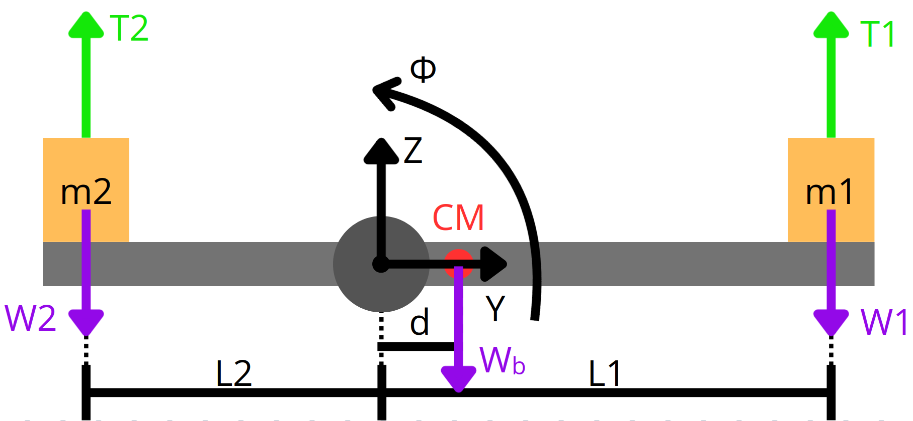

# Controlador PID de Bancada Assimétrica

Este projeto simula o comportamento dinâmico de uma bancada rotacional com centro de massa deslocado e massas assimétricas nos motores, utilizando um controlador PID para estabilização. A modelagem é resolvida numericamente pelo método de Runge-Kutta de 4ª ordem (RK4), implementado em Python.

## Objetivo

Demonstrar a aplicação de controle PID em um sistema de uma bancada com assimetria estrutural.



## Como executar

1. Clone o repositório:
   ```bash
   git clone https://github.com/gustavocabal/Controlador-PID-de-Bancada-Assimetrica.git
   cd Controlador-PID-de-Bancada-Assimetrica
2. Instale a biblioteca matplotlib
    ```bash
    pip install matplotlib
3. Execute
    ```bash
    python main.py
## Bibliotecas utilizadas

- math
- matplotlib

## Funcionamento do código

O script em Python está estruturado em funções para modularizar a simulação. O fluxo principal ocorre da seguinte forma:

* **`parametros_sistema()`**: Esta função define todas as características físicas da bancada de testes. São inseridos valores como as massas dos motores e da barra, dimensões e o coeficiente de amortecimento. A partir disso, são calculados e retornados parâmetros essenciais para a simulação, como o momento de inércia total do sistema (J) e o torque gerado pelos pesos ($T_{peso}$).

* **`pid()`**: É a função principal que executa a simulação. Nela:
    * São definidos os ganhos do controlador PID (`kp`, `kd`, `ki`).
    * São estabelecidas as condições iniciais do sistema, como o ângulo ($\phi_0$) e a velocidade angular iniciais.
    * É iniciado um laço que itera no tempo para resolver o sistema de equações diferenciais.

* **Resolução Numérica (RK4)**: Dentro do laço principal, o método de Runge-Kutta de 4ª ordem é utilizado para encontrar a solução do sistema. A cada passo de tempo, são calculadas quatro estimativas das derivadas ($\kappa_1, \kappa_2, \kappa_3, \kappa_4$) para cada variável de estado, e uma média ponderada é usada para obter o próximo estado com alta precisão.

* **`calculo_torque()`**: A cada etapa do método RK4, esta função é chamada para determinar o torque dos motores e o torque total aplicado ao sistema. O cálculo leva em conta a ação do controlador PID, o efeito do amortecimento e o torque gerado pela gravidade devido à assimetria da bancada.

* **`plot_grafico()`**: Ao final da simulação, os dados de posição angular e torques, que foram armazenados em listas, são enviados para esta função. Ela utiliza a biblioteca `matplotlib` para exibir dois gráficos: a posição angular da barra ao longo do tempo e os torques aplicados no sistema.